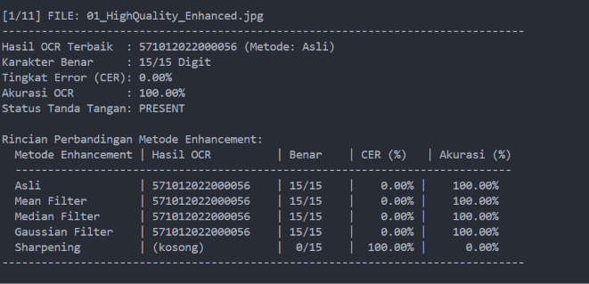
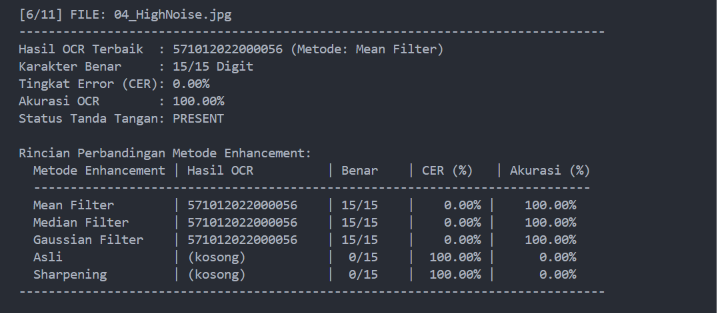

# MINI PROJECT: SISTEM VERIFIKASI KEASLIAN IJAZAH DAN ANALISIS ENHANCEMENT ROI NOMOR IJAZAH

Dokumentasi ini berisi penyelesaian TUGAS 07 / Integrasi Proyek Mini mata kuliah Pengolahan Citra Digital untuk membangun sistem otomatisasi verifikasi dokumen ijazah. Sistem ini mengintegrasikan deteksi keabsahan tanda tangan, koreksi orientasi otomatis, peningkatan kualitas citra (image enhancement) pada area nomor ijazah, serta ekstraksi teks menggunakan Optical Character Recognition (OCR) Tesseract dengan evaluasi Character Error Rate (CER).

---

## Deskripsi & Alur Kerja Sistem

Sistem ini memproses citra ijazah dengan alur kerja sebagai berikut:

1. **Preprocessing Global:**

- **Orientasi Otomatis (OSD):** Mendeteksi sudut kemiringan citra (0°, 90°, 180°, 270°) menggunakan Tesseract OSD dan memutarnya hingga tegak.
- **Konversi Grayscale:** Mengubah citra masukan menjadi skala abu-abu.
- **Peningkatan Kontras (CLAHE):** Mengaplikasikan Contrast Limited Adaptive Histogram Equalization untuk memperjelas area yang samar.

2. **Deteksi Tanda Tangan:**

- **Segmentasi & Binarisasi:** Menggunakan Otsu Thresholding dan operasi morfologi Closing.
- **Ekstraksi Fitur Keputusan:** Mengevaluasi komponen terhubung (connected components) berdasarkan Aspect Ratio (> 1.2), Luas Area Piksel (300–8000 piksel), dan Kepadatan Piksel (0.1–0.7).
- **Klasifikasi Status:** Memutuskan status tanda tangan (SIGNATURE PRESENT / SIGNATURE ABSENT).

3. **Pemotongan ROI & Enhancement Nomor Ijazah:**

- Memotong area koordinat (Region of Interest) nomor ijazah.
- Menguji 5 variasi metode enhancement: Original (Asli), Gaussian Blur, Median Blur, Mean Blur, dan Sharpening (Laplacian).

4. **Ekstraksi OCR & Evaluasi Performa:**

- Menjalankan Tesseract OCR pada masing-masing hasil enhancement.
- Menghitung nilai Character Error Rate (CER) untuk menentukan metode enhancement yang paling efektif.

---

## 📁 Struktur Folder Proyek

```text
Tugas07 Integrasi Proyek Mini/
├── citra_ijazah/               # Dataset citra masukan ijazah (.jpg, .png)
├── verifikasi_file_ijazah.py   # Skrip analisis khusus untuk SATU FILE citra tunggal
├── verifikasi_folder_ijazah.py # Skrip analisis BATCH/OTOMATIS untuk SELURUH FOLDER
└── README.md                   # Dokumentasi ringkas & penjelasan analisis

```

---

## Cara Menjalankan Program

Sistem menyediakan 2 jenis file skrip eksekusi yang dapat dijalankan sesuai kebutuhan:

**1. Instalasi Pustaka**

```bash
pip install opencv-python numpy pytesseract jiwer pandas openpyxl

```

**2. Menjalankan Analisis Khusus Satu File (`verifikasi_file_ijazah.py`)**

Gunakan skrip ini untuk memeriksa dan menginspeksi hasil pemrosesan serta visualisasi secara detail dari satu lembar citra ijazah spesifik:

```bash
python "verifikasi_file_ijazah.py"

```

**3. Menjalankan Analisis Otomatis Berdasarkan Folder (`verifikasi_folder_ijazah.py`)**

Gunakan skrip ini untuk memproses secara massal (batch processing) seluruh dataset ijazah yang ada di dalam folder `citra_ijazah/`:

```bash
python "verifikasi_folder_ijazah.py"

```

_Skrip ini akan memproses setiap citra secara otomatis, menampilkan rekapitulasi status tanda tangan, hasil ekstraksi OCR dari ke-5 metode enhancement, serta nilai CER pada terminal._

---

## Analisis & Pembahasan Soal

### 1. Penjelasan Metode yang Digunakan

Proses enhancement dilakukan pada ROI nomor ijazah dengan tujuan membersihkan noise pemindaian tanpa merusak tekstur huruf/angka. Metode yang diuji antara antara lain:

- **Asli:** Citra ROI hanya melewati tahap binarisasi standar tanpa filter pemulusan.
- **Gaussian Blur (3x3):** Menghilangkan noise dengan pembobotan distribusi normal Gaussian.
- **Median Blur (3x3):** Mengganti nilai piksel dengan nilai median tetangganya, sangat efektif menghilangkan salt-and-pepper noise.
- **Mean Blur (3x3):** Memuluskan citra dengan rata-rata piksel lokal.
- **Sharpening (Kernel Laplacian):** Menggunakan kernel penajaman untuk memperjelas tepi karakter.

---

### 2. Analisis Metode Terefektif (Berdasarkan CER)

Berdasarkan pengujian eksperimental pada seluruh dataset ijazah (11 file citra), diperoleh analisis komparatif sebagai berikut:

- **Filter Pemulusan (Mean Filter, Median Filter, dan Gaussian Filter) — TEREFEKTIF**
- **Rata-rata CER:** **0.00%** (Akurasi Karakter 100%).
- **Analisis:** Filter pemulusan ukuran 3x3 berhasil meredam bintik-bintik noise latar belakang kertas hasil pemindaian. Hal ini membuat garis tepi karakter nomor ijazah menjadi mulus saat binarisasi, sehingga mesin OCR Tesseract dapat mengenali pola karakter dengan sempurna di seluruh kondisi citra (termasuk citra dengan derau tinggi).
- **Sharpening (Penajaman Kernel Laplacian) — TERBURUK**
- **Rata-rata CER:** **> 33.00%** (Bahkan mencapai **100.00%** pada beberapa citra ber-noise tinggi dan kompresi).
- **Analisis:** Operasi penajaman meningkatkan gradien intensitas piksel secara agresif. Akibatnya, bintik-bintik halus (noise) latar belakang ikut tertajamkan dan terbaca oleh Tesseract sebagai karakter sampah (ghost characters) atau menyebabkan kegagalan pembacaan teks sama sekali.

---

### 3. Studi Kasus Perbandingan Hasil Citra Asli

Berikut adalah perbandingan hasil ekstraksi OCR dan nilai CER pada contoh kasus citra terbaik dan terburuk dari dataset uji:

**A. Contoh Kasus Terbaik (Citra Berkualitas Tinggi / Minimal Noise)**



_Pada citra berkualitas tinggi, seluruh filter pemulusan dan citra asli bekerja sempurna dengan CER 0.00%, sedangkan Sharpening langsung mengalami kegagalan total._

**B. Contoh Kasus Terburuk (Citra Ber-Noise Tinggi / Degraded Image)**



_Kasus ini membuktikan bahwa pada citra ber-noise tinggi, citra Asli dan Sharpening gagal total (CER 100.00%), sedangkan filter pemulusan (Mean, Median, Gaussian) terbukti sangat handal menekan CER hingga 0.00%._
